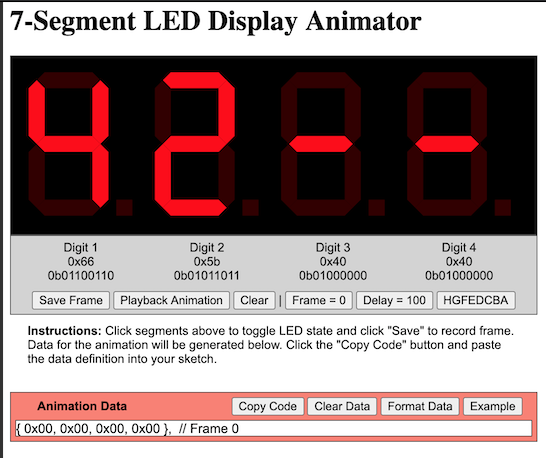

# TM1637TinyDisplay Examples
[](https://github.com/jasonacox/TM1637TinyDisplay/actions/workflows/sketch.yml)

## Test Sketch
* [TM1637Test.ino](TM1637Test/TM1637Test.ino) sketch will test the library functions.

## Test Sketch for 6-Digit Display
* [TM1637-6Digit-Test.ino](TM1637-6Digit-Test/TM1637-6Digit-Test.ino) sketch will test the library functions.

## Demo Sketch
* [TM1637Demo.ino](TM1637Demo/TM1637Demo.ino) sketch will demonstrate the library functions
and play an extended set of animation sequences.  The animations were built with the [Animator Tool](https://jasonacox.github.io/TM1637TinyDisplay/examples/7-segment-animator.html) referenced below.

## Countdown Timer
* [TM1637-Countdown.ino](TM1637-Countdown/TM1637-Countdown.ino) sketch is an example of using the library for a countdown timer. Works with 4-Digit and 6-Digit displays.
* [TM1637-Countdown-Buttons.ino](TM1637-Countdown-Buttons/TM1637-Countdown-Buttons.ino) same as the above but adds buttons and interactive logic to set countdown time.

## Non-Blocking Animations/Scrolling Example
* [TM1637-NonBlockingAnimate.ino](TM1637-NonBlockingAnimate/TM1637-NonBlockingAnimate.ino) sketch contains examples of using the library to do animations and text scrolling in a non-blocking manner. Works with 4-Digit display.


## Animation

### 7-Segment LED Display Animator Tool


This tool will allow the user to visually toggle on/off LEDs in a 4-digit
7-segment display to create a pattern.  It calculates the hexadecimal and binary
values for the pattern.  You can SAVE the pattern as a frame in an
animation sequence which will show up in the "Animation Data" section below 
the controls. To see the animation, press the PLAYBACK button. Once
complete, press the COPY button to copy the code to your clipboard and paste the data
into your sketch. 

[https://jasonacox.github.io/TM1637TinyDisplay/examples/7-segment-animator.html](https://jasonacox.github.io/TM1637TinyDisplay/examples/7-segment-animator.html)

### Animation showAnimation() Function
The showAnimation() function projects a sequence of frames (patterns) onto the display.  This works by provide the function a multi-dimensional array of patterns.  

As mentioned above, you can use the javascript based interactive [7-Segment LED Animator Tool](https://jasonacox.github.io/TM1637TinyDisplay/examples/7-segment-animator.html) to help build your animation. The source code is in this single-file HTML: [7-segment-animator.html](7-segment-animator.html) which you can run from your local file system or a website.  This tool will let you set up the LED sequences you want, save each frame and copy the final code (a static array) directly into your sketch to use for the `showAnimation(data, frames, timing)` function.  Here is an example implementation:

```cpp
#include <Arduino.h>
#include <TM1637TinyDisplay.h>

// Define Digital Pins
#define CLK 4
#define DIO 5

// Initialize TM1637TinyDisplay
TM1637TinyDisplay display(CLK, DIO);

// Data from Animator Tool
const uint8_t ANIMATION[12][4] = {
  { 0x08, 0x00, 0x00, 0x00 },  // Frame 0
  { 0x00, 0x08, 0x00, 0x00 },  // Frame 1
  { 0x00, 0x00, 0x08, 0x00 },  // Frame 2
  { 0x00, 0x00, 0x00, 0x08 },  // Frame 3
  { 0x00, 0x00, 0x00, 0x04 },  // Frame 4
  { 0x00, 0x00, 0x00, 0x02 },  // Frame 5
  { 0x00, 0x00, 0x00, 0x01 },  // Frame 6
  { 0x00, 0x00, 0x01, 0x00 },  // Frame 7
  { 0x00, 0x01, 0x00, 0x00 },  // Frame 8
  { 0x01, 0x00, 0x00, 0x00 },  // Frame 9
  { 0x20, 0x00, 0x00, 0x00 },  // Frame 10
  { 0x10, 0x00, 0x00, 0x00 }   // Frame 11
};

void setup() {
  display.setBrightness(0x0f);
}

void loop() {
  // Display Animation sequence
  display.showAnimation(ANIMATION, FRAMES(ANIMATION), TIME_MS(50));
}
```
